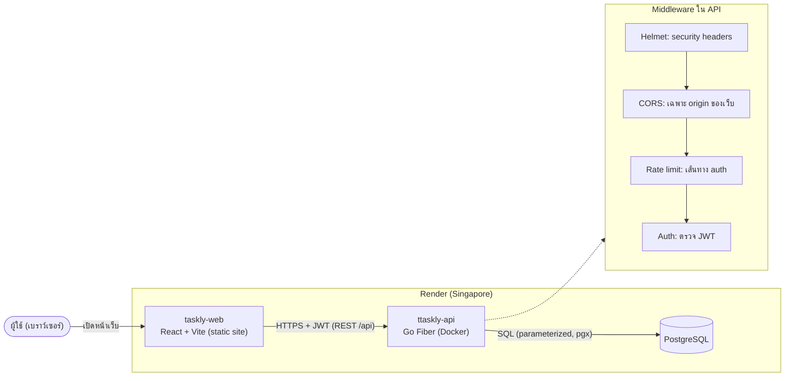
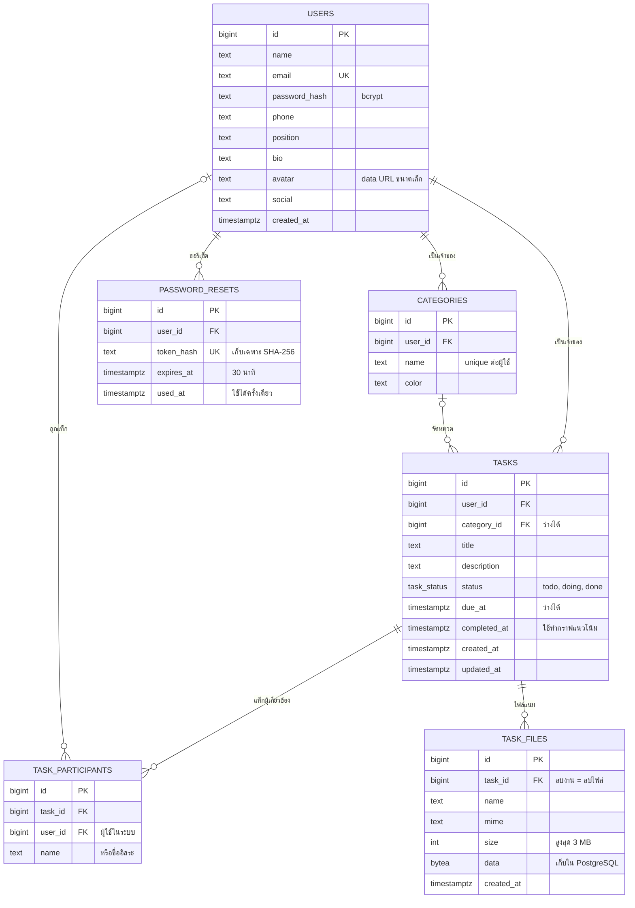
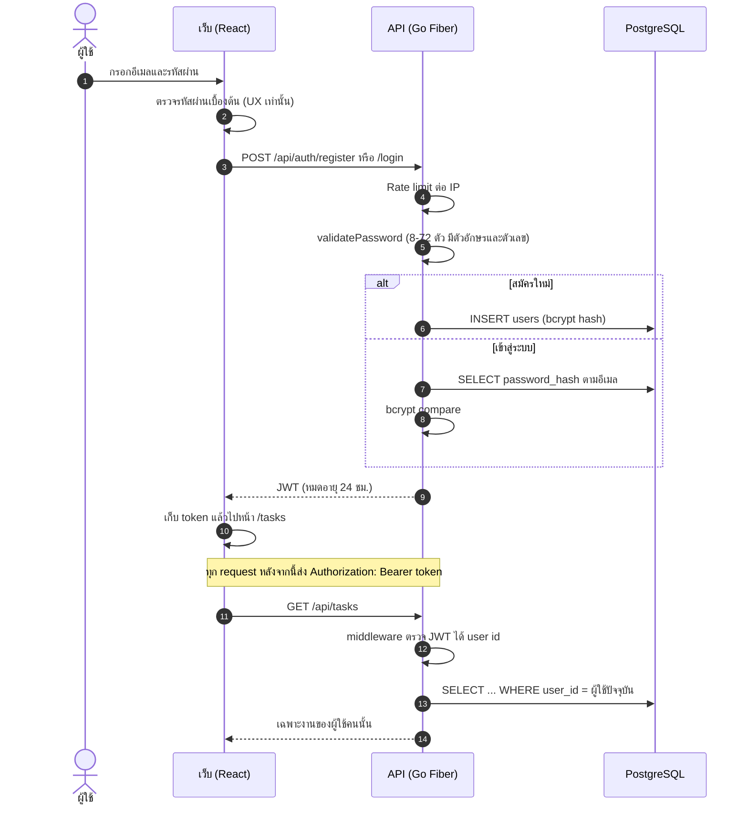
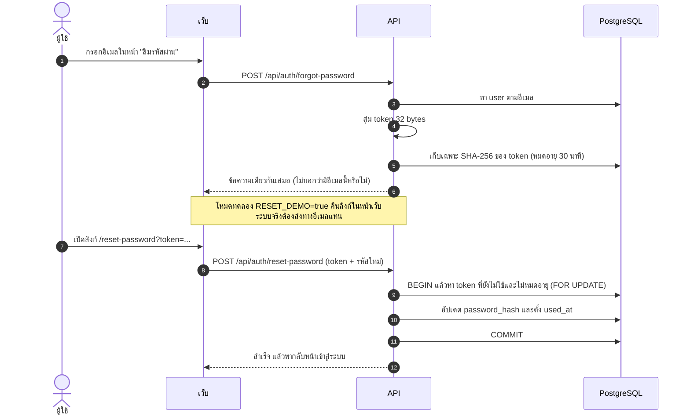
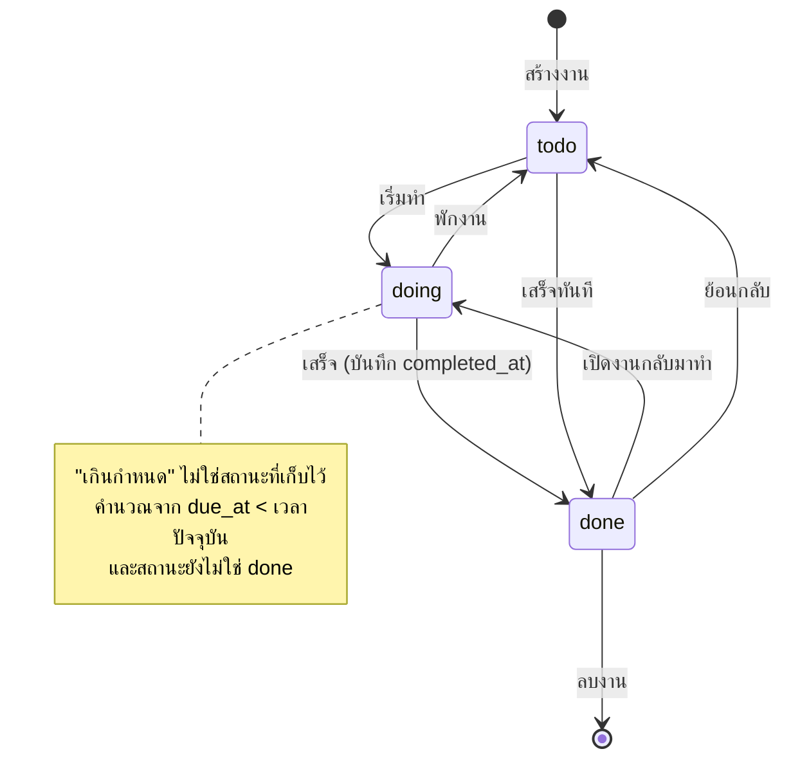
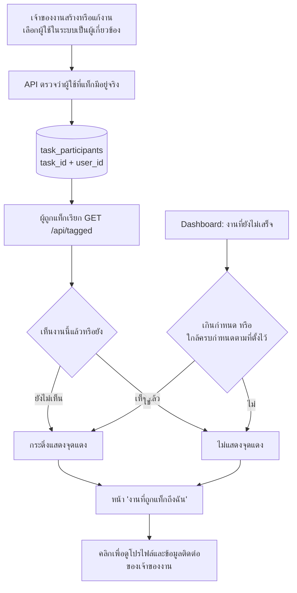
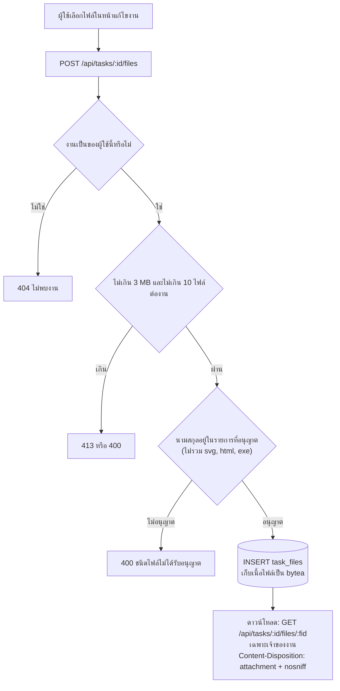
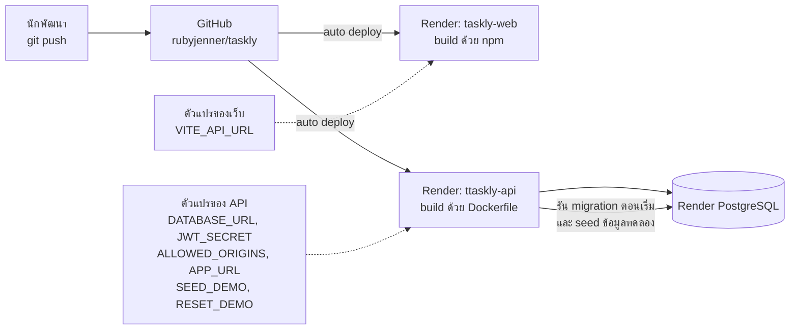

# Taskly: สถาปัตยกรรมและ Flow

เอกสารนี้สรุปภาพรวมระบบ ฐานข้อมูล และขั้นตอนการทำงานหลักของ Taskly
แผนภาพทั้งหมดเขียนด้วย [Mermaid](https://mermaid.js.org/) ซึ่ง GitHub แสดงเป็นภาพให้อัตโนมัติ

## 1. ภาพรวมระบบ

## 2. โครงสร้างฐานข้อมูล

> ไฟล์แนบเก็บเป็น `bytea` ใน PostgreSQL เพราะดิสก์ของโฮสต์ฟรีไม่ถาวร (ถ้าต้องรองรับไฟล์ใหญ่หรือจำนวนมาก ควรย้ายไปที่เก็บไฟล์ภายนอก เช่น object storage)

## 3. สมัครสมาชิกและเข้าสู่ระบบ

## 4. ลืมรหัสผ่านและตั้งรหัสใหม่

## 5. สถานะของงาน

## 6. แท็กผู้เกี่ยวข้องและการแจ้งเตือน

## 7. ไฟล์แนบของงาน

## 8. การ deploy

## 9. API หลัก

| กลุ่ม | เส้นทาง |
|---|---|
| ระบบ | `GET /health` (ไม่ต้องล็อกอิน) |
| Auth | `POST /api/auth/register`, `/login`, `/forgot-password`, `/reset-password` |
| บัญชี | `GET/PUT/DELETE /api/me`, `POST /api/me/password` |
| หมวดหมู่ | `GET/POST /api/categories`, `PUT/DELETE /api/categories/:id` |
| งาน | `GET/POST /api/tasks`, `GET/PUT/DELETE /api/tasks/:id`, `PATCH /api/tasks/:id/status` |
| ไฟล์แนบ | `GET/POST /api/tasks/:id/files`, `GET/DELETE /api/tasks/:id/files/:fid` |
| สรุปและทีม | `GET /api/dashboard`, `GET /api/tagged`, `GET /api/users/search` |

ทุกเส้นทางนอกจากกลุ่ม Auth ต้องแนบ JWT และทุก query กรองด้วยเจ้าของข้อมูล
